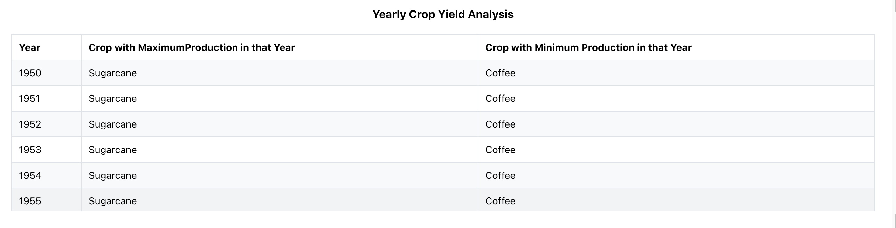
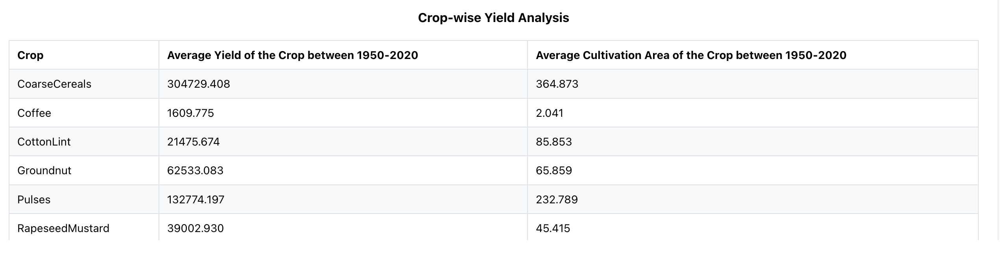

# Data Analysis Task

This React application performs analytics on the Indian Agriculture dataset provided by the National Data and Analytics Platform, NITI Aayog.

## Introduction

The purpose of this application is to analyze the Indian Agriculture dataset and display the results as tables. Missing cell values in the dataset are treated as 0.

## Analytics

The following analytics are performed on the dataset:

1. **Yearly Crop Yield Analysis**: Analysis of crop yields over the years.
   

2. **Crop-wise Yield Analysis**: Analysis of yield for each crop.
   

_Note: The range is 1950 - 2020._

## Installation

To get started with this project, follow these steps:

1. Clone the repository:

```sh
git clone https://github.com/rahuls24/data-analysis-task.git
```

2. Navigate to the project directory:

```sh
cd data-analysis-task
```

3. Install dependencies using Yarn:

```sh
yarn install
```

## Running Locally

To run the project locally, you can use the following command:

```sh
yarn start
```

This will start the development server and open the application in your default web browser.
